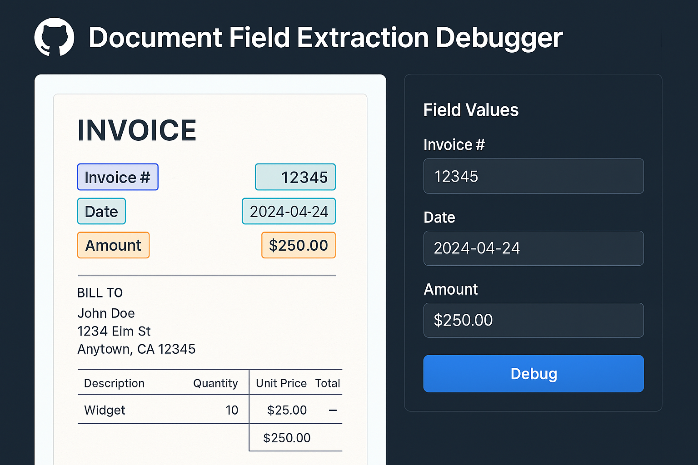

# Document Field Extraction Tool




This tool helps you extract specific fields from documents (PDFs, etc.) using AI-powered extraction. It converts documents to markdown format first and then uses AI to identify and extract the required fields based on your schema definitions.

## What is this?

This tool provides a workflow to:
1. Convert various document formats to markdown
2. Define the fields you want to extract using JSON schemas
3. Use AI to extract the specified fields from the documents
4. Output the extracted data in a structured format

## Requirements

- Python 3.x
- Required Python packages (install via `pip install -r requirements.txt`):
  - See requirements.txt for the complete list of dependencies

## Installation

1. Clone this repository:
```bash
git clone <repository-url>
cd extraction_debugger
```

2. Create and activate a virtual environment:

```bash
python -m venv venv
source venv/bin/activate
```

3. Install the required packages:
```bash
pip install -r requirements.txt
```

## Usage Steps

### 1. Prepare Documents
Place your documents (PDFs, etc.) in the `/docs` directory.

### 2. Define Extraction Schema
Create a JSON schema in the `/schemas` directory that defines the fields you want to extract. The schema should specify:
- Field names
- Field descriptions

### 3. Define Output Schema
Create a JSON schema in the `/output_schemas` directory that defines the structure of your output data. This schema should match the fields you want to extract.

### 4. Convert Documents
Run the document conversion script:
```bash
python convert_to_markdown.py
```
This will:
- Process all documents in the `/docs` directory
- Convert them to markdown format
- Save the output in the `/outputs` directory

### 5. Extract Fields
Run the extraction script:
```bash
python extract.py
```

The script will:
- Ask interactive questions about the extraction process
- Use AI to identify and extract the specified fields
- Output the results according to your output schema

You can specify multiple runs to see how consistent the results are.

### Configuration
You can configure the extraction process by creating a `config.json` file. This allows you to:
- Skip interactive questions
- Set specific parameters for the extraction
- Configure AI model settings

## Directory Structure

```
.
├── docs/               # Place your input documents here
├── schemas/           # Define your extraction schemas here
├── output_schemas/    # Define your output schemas here
├── outputs/           # Contains converted markdown files
├── convert_to_markdown.py
├── extract.py
└── config.json        # Optional configuration file
```

## Example

1. Place a PDF invoice in `/docs`
2. Create a schema in `/schemas` defining fields like "invoice_number", "total_amount", etc.
3. Create an output schema in `/output_schemas` matching your desired output format
4. Run `convert_to_markdown.py`
5. Run `extract.py`
6. Get your extracted fields in the specified output format
